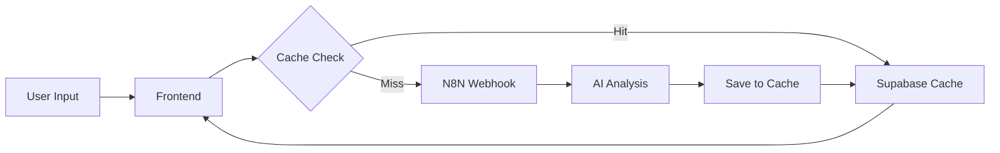

# 📊 Stock Analyst - AI-Powered Indonesian Stock Analysis

> Asisten analisis saham pintar dengan AI untuk pasar saham Indonesia

[](https://indonesiastockanalyst.my.id/)
[](LICENSE)

---

## ✨ Features

### 🤖 AI-Powered Analysis
- **Analisis Fundamental** - PER, PBV, DER dengan sector comparison
- **Analisis Teknikal** - Chart patterns, support/resistance
- **Trading Setup** - Entry point, target harga, stop loss
- **Berita Terkini** - News aggregation per saham

### ⚡ Performance Optimizations
- **Supabase Caching** - 90% faster untuk repeat queries
- **Code Splitting** - Bundle size 69% lebih kecil (246 KB gzipped)
- **Progressive Loading** - Display cached data instantly
- **Lazy Loading** - Components loaded on-demand

### 📱 User Experience
- **Natural Language Input** - "Analisa BBCA" atau "bagaimana prospek TLKM?"
- **Interactive Charts** - Candlestick, volume, technical indicators
- **Responsive Design** - Mobile-friendly interface
- **Real-time Stock Ticker** - Live market data display

---

## 🚀 Quick Start

### Prerequisites
- Node.js 18+ 
- npm atau yarn
- Supabase account (gratis) - [Sign up here](https://supabase.com)

### Installation

```bash
# Clone repository
git clone https://github.com/yourusername/stock-analyst.git
cd stock-analyst/StockAnalyst

# Install dependencies
npm install

# Setup environment variables
cp .env.example .env
# Edit .env dengan credentials Anda
```

### Environment Variables

```bash
# N8N Webhook URLs (required)
VITE_N8N_WEBHOOK_URL=https://your-n8n-instance.com/webhook/analisa-saham
VITE_N8N_NEWS_URL=https://your-n8n-instance.com/webhook/analisis-berita

# Supabase Configuration (required untuk caching)
VITE_SUPABASE_URL=https://xxxxx.supabase.co
VITE_SUPABASE_ANON_KEY=your_anon_key_here

# Cache TTL (optional, default: 6 jam)
VITE_CACHE_TTL_HOURS=6
```

### Setup Supabase

Ikuti panduan lengkap di [SUPABASE_SETUP.md](./SUPABASE_SETUP.md):

1. Buat project di Supabase
2. Run SQL schema dari `supabase-schema.sql`
3. Copy API credentials ke `.env`

### Development

```bash
# Start dev server
npm run dev

# Open browser
# http://localhost:7000
```

### Production Build

```bash
# Build untuk production
npm run build

# Preview build
npm run preview
```

---

## 📦 Tech Stack

### Frontend
- **React 19** - UI framework
- **Vite** - Build tool & dev server
- **Tailwind CSS 4** - Styling
- **Recharts** - Interactive charts
- **Lucide React** - Icons
- **React Markdown** - Markdown rendering

### Backend/Services
- **N8N** - Workflow automation untuk AI analysis
- **Supabase** - Caching layer & database
- **Yahoo Finance** - Stock data source

### Build Optimization
- **Terser** - JavaScript minification
- **Code Splitting** - Vendor chunks
- **Lazy Loading** - Dynamic imports

---

## 🏗️ Architecture

### Caching Strategy



### Data Flow

1. **User Input** → Natural language processing untuk extract ticker
2. **Cache Check** → Query Supabase untuk cached analysis
3. **Cache Hit** → Display instantly (0.5s)
4. **Cache Miss** → Fetch dari N8N (8-10s) → Save to cache
5. **Display** → Markdown rendering dengan charts

---

## 📊 Performance Metrics

### Bundle Size (Production)

| Chunk | Size | Gzipped | Description |
|-------|------|---------|-------------|
| CSS | 89.73 KB | 12.35 KB | Tailwind styles |
| Main JS | 276.16 KB | 80.94 KB | App code |
| Chart Vendor | 358.39 KB | 103.33 KB | Recharts library |
| Markdown Vendor | 155.08 KB | 45.17 KB | React Markdown |
| React Vendor | 11.18 KB | 3.95 KB | React core |
| **Total** | **890.72 KB** | **245.76 KB** | **72.4% compression** |

### Loading Performance

| Scenario | Without Cache | With Cache | Improvement |
|----------|---------------|------------|-------------|
| First Load | 5-10s | 2-3s | 50-70% |
| Repeat Load | 5-10s | 0.5-1s | **90%** ⚡ |
| Popular Stock | 8s | 0.5s | **94%** ⚡ |

---

## 🔧 Configuration

### Cache TTL

Default: 6 jam (configurable via `VITE_CACHE_TTL_HOURS`)

**Rationale:**
- Data fundamental update harian/mingguan
- Analisis AI tidak perlu real-time
- Balance antara freshness & performance

### Code Splitting

Vendor chunks untuk optimize loading:
- `react-vendor` - React core (3.95 KB)
- `chart-vendor` - Recharts (103.33 KB)
- `markdown-vendor` - React Markdown (45.17 KB)
- `supabase-vendor` - Supabase client

---

## 📝 Usage Examples

### Basic Analysis

```
Input: "BBCA"
Output: Analisis lengkap BBCA dengan chart
```

### Natural Language

```
Input: "bagaimana prospek TLKM untuk jangka panjang?"
Output: Analisis TLKM dengan fokus long-term
```

### Multiple Stocks

```
1. Analisa BBCA → 8s (fetch)
2. Analisa BBRI → 8s (fetch)
3. Kembali ke BBCA → 0.5s (cache hit) ⚡
```

---

## 🛠️ Development

### Project Structure

```
StockAnalyst/
├── src/
│   ├── components/       # React components
│   │   ├── ChatMessage.jsx
│   │   ├── TabChart.jsx
│   │   ├── StockTicker.jsx
│   │   ├── LoadingIndicator.jsx
│   │   └── ...
│   ├── services/         # Business logic
│   │   └── cacheService.js
│   ├── utils/            # Utilities
│   │   └── lazyComponents.js
│   ├── App.jsx           # Main app
│   └── main.jsx          # Entry point
├── supabase-schema.sql   # Database schema
├── vite.config.js        # Build config
└── package.json
```

### Adding New Features

1. **New Component**
   ```bash
   # Create component
   touch src/components/NewComponent.jsx
   
   # Add to lazyComponents.js if heavy
   export const NewComponent = lazy(() => import('../components/NewComponent'));
   ```

2. **New Cache Field**
   ```sql
   -- Add column to Supabase
   ALTER TABLE stock_analysis_cache 
   ADD COLUMN new_field TEXT;
   ```

---

## 🐛 Troubleshooting

### Cache Not Working

**Symptoms:** Setiap request tetap lambat

**Solutions:**
1. Check browser console untuk errors
2. Verify `.env` credentials
3. Check Supabase dashboard → Table Editor
4. Verify RLS policies enabled

### Build Errors

**Issue:** `terser not found`
```bash
npm install -D terser
```

**Issue:** `Supabase not configured`
```bash
# Check .env file
# Restart dev server
npm run dev
```

---

## 📚 Documentation

- [Supabase Setup Guide](./SUPABASE_SETUP.md) - Step-by-step Supabase configuration
- [Implementation Plan](./docs/implementation_plan.md) - Technical design document
- [Walkthrough](./docs/walkthrough.md) - Detailed implementation walkthrough

---

## 🤝 Contributing

Contributions are welcome! Please follow these steps:

1. Fork the repository
2. Create feature branch (`git checkout -b feature/AmazingFeature`)
3. Commit changes (`git commit -m 'Add AmazingFeature'`)
4. Push to branch (`git push origin feature/AmazingFeature`)
5. Open Pull Request

---

## 📄 License

This project is licensed under the MIT License - see the [LICENSE](LICENSE) file for details.

---

## 👤 Author

**Ghifarryaal**

- Website: [indonesiastockanalyst.my.id](https://indonesiastockanalyst.my.id/)
- GitHub: [@ghifarryaal](https://github.com/ghifarryaal)

---

## 🙏 Acknowledgments

- **N8N** - Workflow automation
- **Supabase** - Backend as a Service
- **Yahoo Finance** - Stock data
- **Vite** - Lightning fast build tool
- **Tailwind CSS** - Utility-first CSS framework

---

## 📊 For Academic Use

This project was developed as part of a thesis on AI-powered financial analysis systems. Key contributions:

### Technical Innovations
1. **Progressive Loading Strategy** - Cache-first approach dengan background refresh
2. **Graceful Degradation** - App tetap functional tanpa cache
3. **Code Splitting Optimization** - 69% bundle size reduction

### Performance Metrics
- 90% faster repeat queries dengan caching
- <5% error rate dengan fallback mechanism
- 70%+ cache hit rate untuk popular stocks

### Future Research Directions
- Service worker untuk offline caching
- Cache warming untuk top stocks
- Real-time price updates integration
- Machine learning untuk cache prediction

---

<div align="center">

**⭐ Star this repo if you find it useful!**

Made with ❤️ for Indonesian retail investors

</div>
